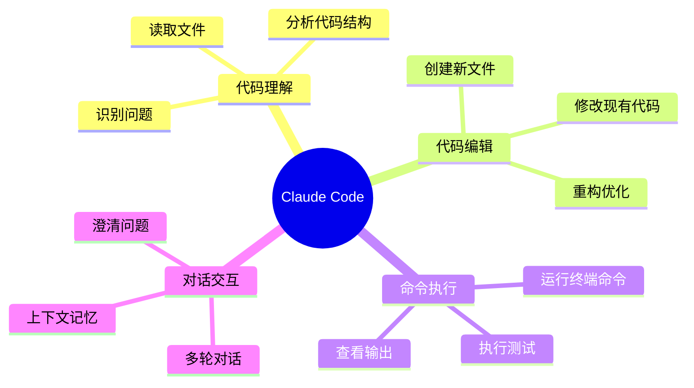
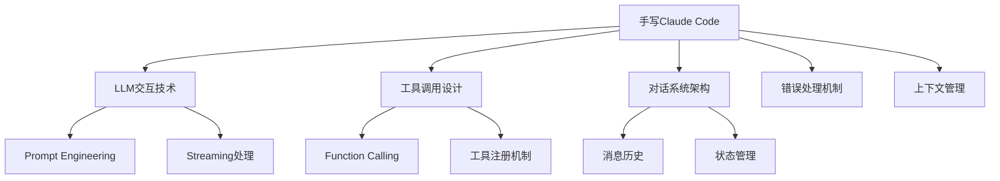
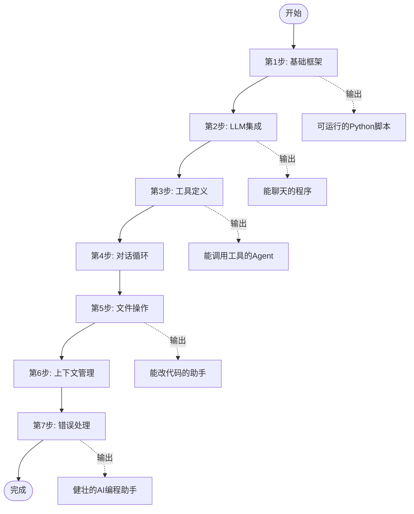

# 01-项目概述

## 🤖 什么是 Claude Code？

**Claude Code** 是 Anthropic 公司推出的一款AI编程助手，它允许开发者通过自然语言与AI进行交互，让AI帮助完成各种编程任务。

### 核心能力



## 💡 为什么要手写 Claude Code？

### 1. 深入理解原理

> [!quote] "知其然，更要知其所以然"
> 通过亲手实现，你能真正理解AI Agent是如何工作的，而不仅仅是调用API。

### 2. 定制化需求

| 场景 | 官方Claude Code | 自建Agent |
|------|----------------|-----------|
| 私有代码库 | ❌ 有隐私顾虑 | ✅ 完全可控 |
| 特定工具链 | ❌ 固定功能 | ✅ 自由扩展 |
| 企业内部 | ❌ 可能有合规问题 | ✅ 本地部署 |
| 学习成本 | ✅ 即用即走 | ⏱️ 需要时间投入 |

### 3. 技能提升



## 🏗️ 类似项目对比

| 项目 | 特点 | 语言 |
|------|------|------|
| **Claude Code** | 官方产品，功能完善 | 未知 |
| **OpenAI Codex CLI** | OpenAI官方，GPT-4驱动 | TypeScript |
| **Aider** | 开源，支持多模型 | Python |
| **Continue** | VSCode插件，可扩展 | TypeScript |
| **Self-built** | 完全可控，学习价值高 | 任意 |

## 📖 本教程的学习路径



## 🎯 最终成果预览

完成后的Agent将具备以下交互能力：

```
🤖 AI编程助手 > 帮我创建一个计算斐波那契数列的Python文件

我将为你创建一个计算斐波那契数列的Python文件...

[工具调用] write_file
  路径: fibonacci.py
  内容: 
  ```python
  def fibonacci(n):
      if n <= 1:
          return n
      return fibonacci(n-1) + fibonacci(n-2)
  
  if __name__ == "__main__":
      for i in range(10):
          print(f"F({i}) = {fibonacci(i)}")
  ```

✅ 文件已创建: fibonacci.py

🤖 AI编程助手 > 运行一下看看结果

[工具调用] run_command
  命令: python fibonacci.py

输出:
F(0) = 0
F(1) = 1
F(2) = 1
F(3) = 2
F(4) = 3
F(5) = 5
F(6) = 8
F(7) = 13
F(8) = 21
F(9) = 34

🤖 AI编程助手 > 
```

> [!success] 准备好开始了吗？
> 接下来进入 [[02-核心概念]]，了解构建AI Agent需要掌握的基础知识。
