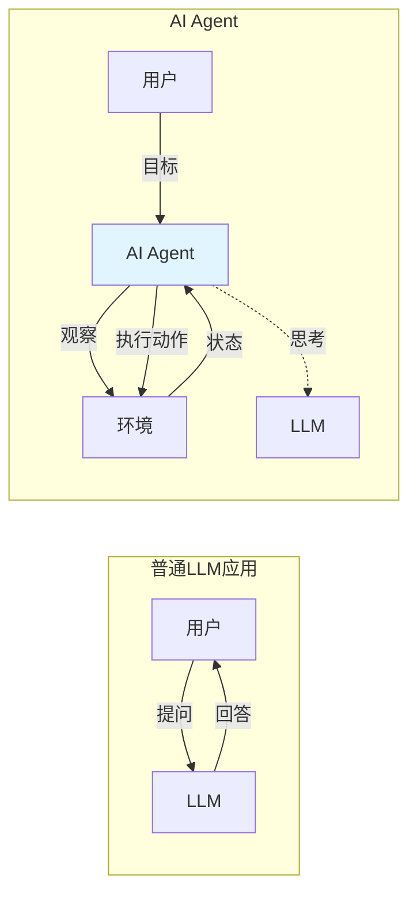
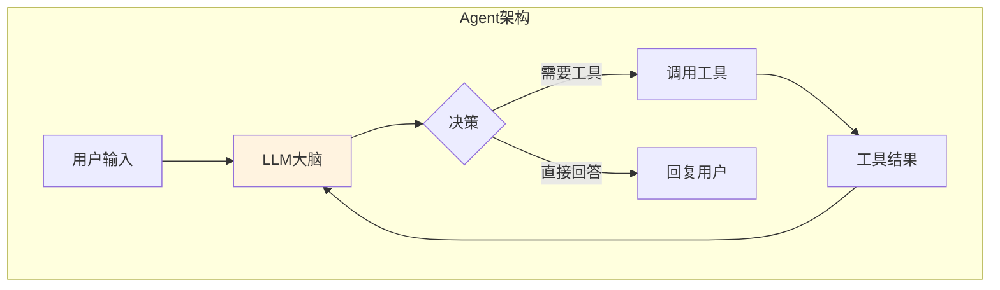
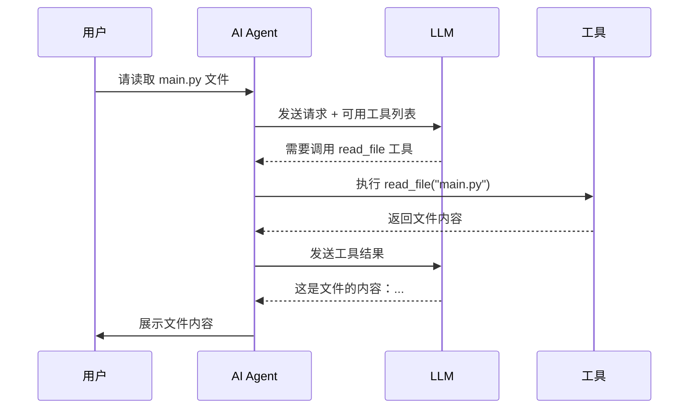
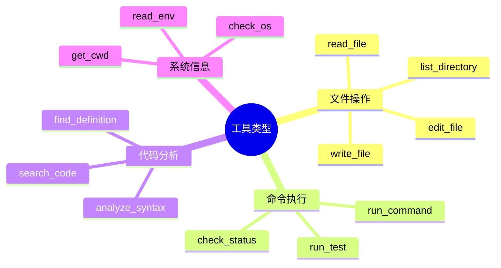
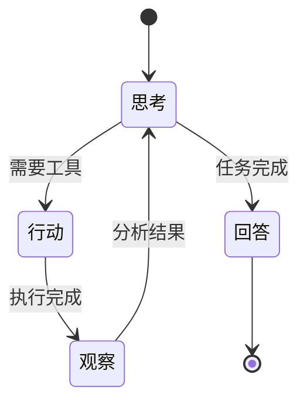
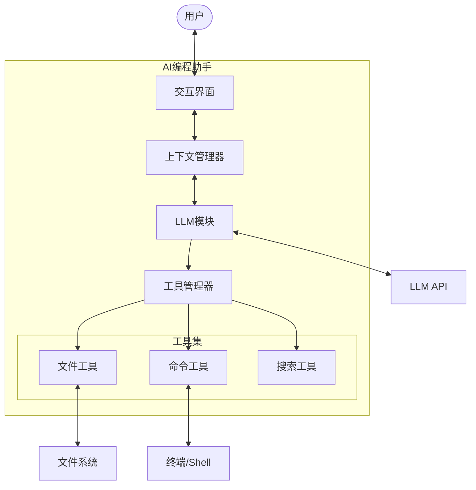

# 02-核心概念

在学习如何构建AI编程助手之前，我们需要先理解几个核心概念。

## 🤖 什么是 AI Agent？

### 定义

> [!info] AI Agent（人工智能代理）
> 一种能够感知环境、做出决策并执行动作以实现特定目标的智能系统。

### Agent vs 普通LLM应用



### 关键区别

| 特性 | 普通LLM应用 | AI Agent |
|------|-------------|----------|
| 交互方式 | 单次问答 | 多轮循环 |
| 执行能力 | 只能输出文本 | 可以执行工具/动作 |
| 记忆能力 | 通常无记忆 | 维护上下文历史 |
| 决策能力 | 被动响应 | 主动规划并执行 |

## 🧠 LLM（大语言模型）

### 在本项目中的角色



### 常用的LLM API

| 提供商 | 模型 | 特点 | 适用场景 |
|--------|------|------|----------|
| **Anthropic** | Claude 3.5 Sonnet | 代码能力强 | 编程助手首选 |
| **OpenAI** | GPT-4/GPT-4o | 综合能力强 | 通用Agent |
| **Google** | Gemini Pro | 长上下文 | 处理大文件 |
| **本地** | Ollama/LM Studio | 私有化 | 隐私敏感场景 |

## 🔧 工具调用（Tool Calling）

### 什么是工具调用？

> [!tip] 核心机制
> 让LLM能够"使用工具"来完成任务，比如读取文件、执行命令、搜索信息等。

### 工作原理



### 常见工具类型



## 💬 对话上下文管理

### 为什么需要上下文？

```
用户: 帮我修改 login.py 文件
AI: [修改了 login.py]
用户: 再改一下样式  ← AI需要知道"再改一下"指的是login.py
```

### 上下文结构

```python
messages = [
    {"role": "system", "content": "你是一个编程助手..."},
    {"role": "user", "content": "帮我修改 login.py"},
    {"role": "assistant", "content": "好的，我来修改..."},
    {"role": "user", "content": "再改一下样式"},
    # ...
]
```

### 消息角色

| 角色 | 用途 | 示例 |
|------|------|------|
| `system` | 设定AI行为 | "你是一个有帮助的编程助手" |
| `user` | 用户输入 | "帮我创建一个函数" |
| `assistant` | AI回复 | "我来帮你创建..." |
| `tool` | 工具结果 | 文件内容、命令输出 |

## 🔄 ReAct 模式

### 什么是 ReAct？

> [!info] ReAct = Reasoning + Acting
> 一种让LLM交替进行推理（思考）和行动（执行）的Agent设计模式。

### ReAct 循环



### 示例流程

```
用户: 项目里有多少个Python文件？

[思考] 用户想知道Python文件数量，我需要先查看项目结构
[行动] 调用 list_directory 工具
[观察] 看到了 src/, tests/, main.py
[思考] 需要递归查看所有目录中的 .py 文件
[行动] 调用 search_code 搜索所有 .py 文件
[观察] 找到12个Python文件
[回答] 项目里共有12个Python文件...
```

## 🏛️ 系统架构概览

### 简化架构图



## 📋 关键术语对照表

| 术语 | 英文 | 说明 |
|------|------|------|
| 智能体 | Agent | 能自主决策执行的AI系统 |
| 提示词 | Prompt | 给LLM的输入指令 |
| 工具调用 | Tool Calling | LLM调用外部功能 |
| 函数调用 | Function Calling | 工具调用的另一种说法 |
| 上下文 | Context | 对话历史和状态 |
| Token | Token | LLM处理文本的最小单位 |
| 流式输出 | Streaming | 逐字显示生成内容 |
| 系统提示 | System Prompt | 定义AI行为的指令 |

> [!success] 概念掌握检查
> - [x] 理解AI Agent和普通LLM的区别
> - [x] 了解工具调用的工作原理
> - [x] 明白上下文管理的重要性
> - [x] 认识ReAct模式
> 
> 下一步：[[03-系统架构]] 深入了解整体架构设计
