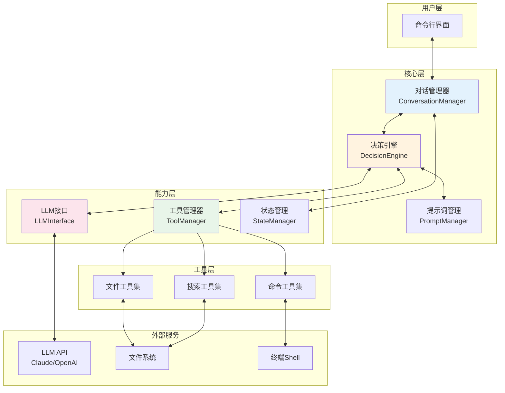
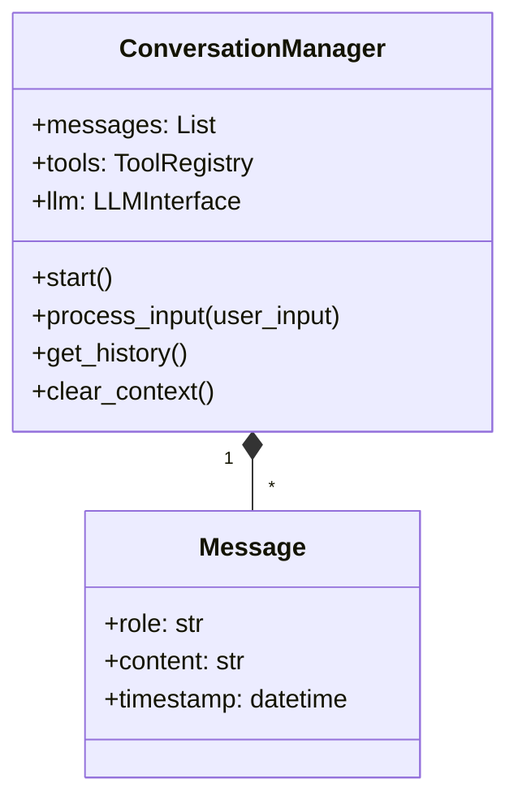
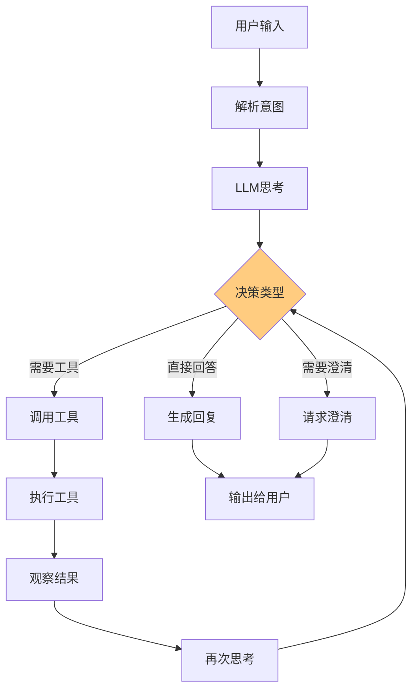
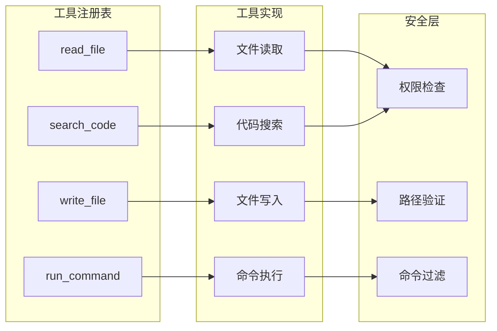
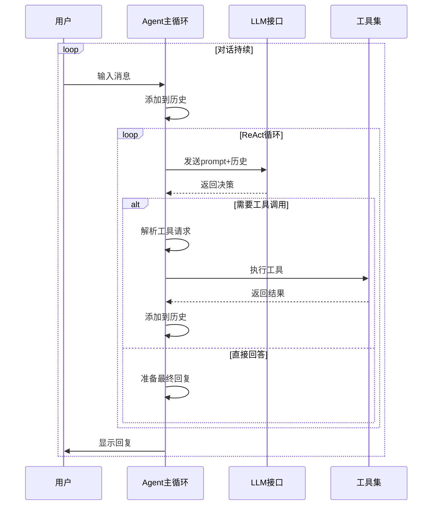
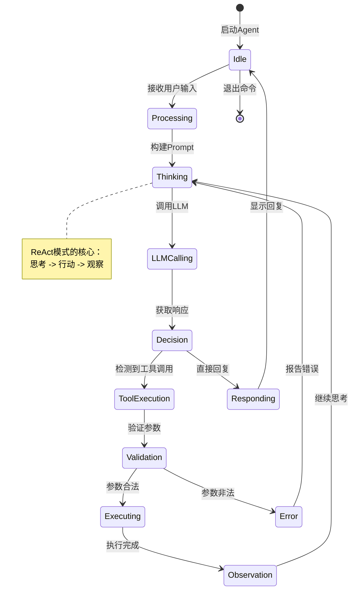
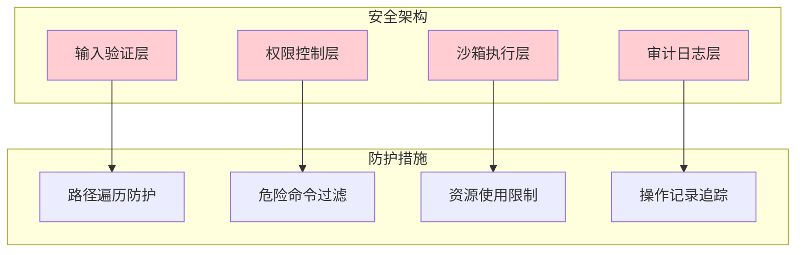
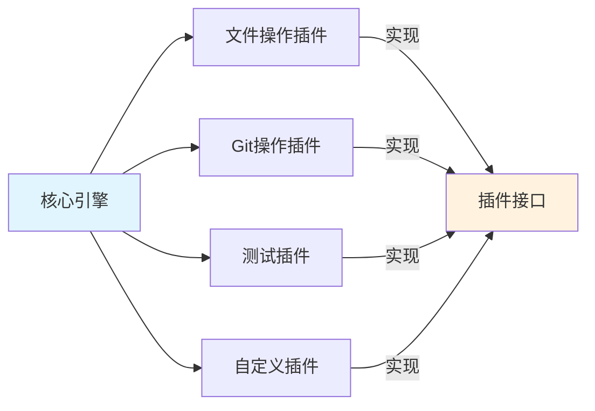

# 03-系统架构

## 🏗️ 整体架构设计



## 📦 核心模块详解

### 1. 对话管理器 (ConversationManager)

> [!info] 职责
> 管理对话生命周期，协调各模块工作。



**核心功能：**
- 维护对话历史
- 管理消息队列
- 处理上下文截断

### 2. 决策引擎 (DecisionEngine)



### 3. 工具管理器 (ToolManager)



## 🔄 主流程设计

### Agent主循环



### 详细流程图



## 📝 数据结构定义

### 消息格式

```python
{
    "role": "user" | "assistant" | "system" | "tool",
    "content": "消息内容",
    "tool_calls": [  # assistant消息可能有
        {
            "id": "call_123",
            "type": "function",
            "function": {
                "name": "read_file",
                "arguments": '{"path": "main.py"}'
            }
        }
    ],
    "tool_call_id": "call_123",  # tool消息需要
    "name": "read_file"  # tool消息需要
}
```

### 工具定义格式

```python
{
    "name": "read_file",
    "description": "读取文件内容",
    "parameters": {
        "type": "object",
        "properties": {
            "path": {
                "type": "string",
                "description": "文件路径"
            }
        },
        "required": ["path"]
    }
}
```

## 🔒 安全架构

### 多层防护



### 关键安全检查点

| 检查点 | 说明 | 示例 |
|--------|------|------|
| 路径验证 | 防止目录遍历 | `../../../etc/passwd` |
| 命令过滤 | 禁止危险命令 | `rm -rf /` |
| 权限检查 | 确认可访问 | 检查文件读/写权限 |
| 资源限制 | 防止资源耗尽 | 限制文件大小、执行时间 |

## 🎯 扩展性设计

### 插件化架构



## 📊 性能考虑

### 优化策略

| 优化点 | 策略 | 效果 |
|--------|------|------|
| Token使用 | 上下文压缩、摘要 | 降低成本 |
| 响应速度 | 流式输出、并行工具 | 提升体验 |
| 工具调用 | 结果缓存 | 减少重复执行 |
| 错误恢复 | 重试机制 | 提高稳定性 |

> [!tip] 架构设计原则
> 1. **模块化**：每个职责独立，便于测试和维护
> 2. **可扩展**：新工具可轻松添加
> 3. **可配置**：关键参数可外部配置
> 4. **安全性**：多层防护，默认安全

下一步：[[04-实现步骤]] 开始动手写代码！
