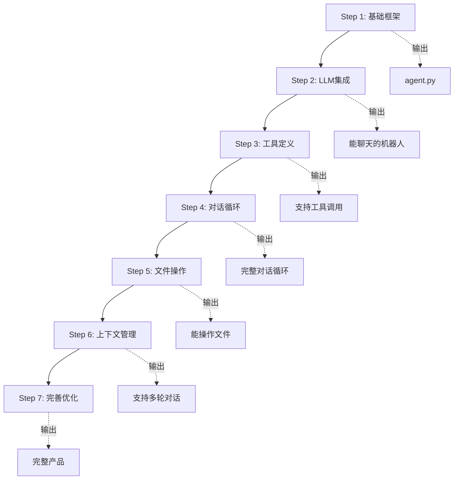

# 04-实现步骤

从零开始构建AI编程助手，我们分7个步骤来实现。

## 🎯 整体流程图



---

## Step 1: 基础框架 🏗️

### 目标
搭建项目结构，创建最基础的Agent类。

### 代码骨架

```python
# agent.py
import os
from typing import List, Dict, Any

class CodeAgent:
    """AI编程助手核心类"""
    
    def __init__(self, api_key: str = None):
        self.api_key = api_key or os.getenv("ANTHROPIC_API_KEY")
        self.messages: List[Dict[str, str]] = []
        self.tools: List[Dict[str, Any]] = []
        
    def run(self):
        """启动交互式会话"""
        print("🤖 AI编程助手已启动 (输入 'exit' 退出)")
        
        while True:
            try:
                user_input = input("\n\u003e ").strip()
                
                if user_input.lower() in ['exit', 'quit']:
                    print("再见！")
                    break
                    
                if not user_input:
                    continue
                
                response = self.process(user_input)
                print(f"\n{response}")
                
            except KeyboardInterrupt:
                print("\n再见！")
                break
            except Exception as e:
                print(f"❌ 错误: {e}")
    
    def process(self, user_input: str) -> str:
        """处理用户输入"""
        # TODO: 实现处理逻辑
        return f"收到: {user_input}"


if __name__ == "__main__":
    agent = CodeAgent()
    agent.run()
```

### 验证运行

```bash
$ python agent.py
🤖 AI编程助手已启动 (输入 'exit' 退出)

> 你好
收到: 你好

> exit
再见！
```

> [!success] Checkpoint 1
> ✓ 项目结构创建
> ✓ 基础类框架
> ✓ 交互循环运行正常

---

## Step 2: LLM集成 🧠

### 目标
集成Anthropic Claude API，让Agent能真正理解和回应。

### 安装依赖

```bash
pip install anthropic rich
```

### 集成代码

```python
# agent.py
import anthropic
from rich.console import Console
from rich.markdown import Markdown

class CodeAgent:
    def __init__(self, api_key: str = None):
        self.api_key = api_key or os.getenv("ANTHROPIC_API_KEY")
        self.client = anthropic.Anthropic(api_key=self.api_key)
        self.console = Console()
        self.model = "claude-3-5-sonnet-20241022"
        
        # 初始化系统消息
        self.messages = []
        self.system_prompt = """你是一个专业的编程助手，可以帮助用户：
1. 读取和理解代码文件
2. 编写和修改代码
3. 运行命令和测试
4. 回答技术问题

请用中文回复用户。"""
    
    def process(self, user_input: str) -> str:
        """处理用户输入并调用LLM"""
        # 添加用户消息
        self.messages.append({
            "role": "user",
            "content": user_input
        })
        
        try:
            # 调用Claude API
            response = self.client.messages.create(
                model=self.model,
                max_tokens=4096,
                system=self.system_prompt,
                messages=self.messages
            )
            
            # 获取回复内容
            assistant_message = response.content[0].text
            
            # 添加到历史
            self.messages.append({
                "role": "assistant",
                "content": assistant_message
            })
            
            return assistant_message
            
        except Exception as e:
            return f"❌ API调用失败: {e}"
```

### 测试对话

```bash
$ export ANTHROPIC_API_KEY="your-api-key"
$ python agent.py
🤖 AI编程助手已启动 (输入 'exit' 退出)

> Python里怎么读取文件？

在Python中，你可以使用内置的 `open()` 函数来读取文件。

最常用的方式是使用 `with` 语句，这样可以确保文件正确关闭：

```python
# 读取整个文件
with open('filename.txt', 'r', encoding='utf-8') as f:
    content = f.read()
    print(content)
```
...
```

> [!success] Checkpoint 2
> ✓ API集成完成
> ✓ 支持基础对话
> ✓ 消息历史维护

---

## Step 3: 工具定义 🛠️

### 目标
定义Agent可以使用的工具，让LLM知道有哪些能力。

### 工具定义

```python
# tools.py
TOOLS = [
    {
        "name": "read_file",
        "description": "读取文件内容，用于查看代码或文本文件",
        "input_schema": {
            "type": "object",
            "properties": {
                "path": {
                    "type": "string",
                    "description": "要读取的文件路径"
                }
            },
            "required": ["path"]
        }
    },
    {
        "name": "write_file",
        "description": "创建或覆盖写入文件",
        "input_schema": {
            "type": "object",
            "properties": {
                "path": {
                    "type": "string",
                    "description": "文件路径"
                },
                "content": {
                    "type": "string",
                    "description": "文件内容"
                }
            },
            "required": ["path", "content"]
        }
    },
    {
        "name": "run_command",
        "description": "执行终端命令，如运行测试、查看git状态等",
        "input_schema": {
            "type": "object",
            "properties": {
                "command": {
                    "type": "string",
                    "description": "要执行的命令"
                }
            },
            "required": ["command"]
        }
    },
    {
        "name": "list_directory",
        "description": "列出目录内容",
        "input_schema": {
            "type": "object",
            "properties": {
                "path": {
                    "type": "string",
                    "description": "目录路径，默认为当前目录"
                }
            }
        }
    }
]
```

### 工具实现

```python
# tools.py
import os
import subprocess
from typing import Dict, Any

def read_file(path: str) -> Dict[str, Any]:
    """读取文件内容"""
    try:
        # 安全检查：防止目录遍历
        abs_path = os.path.abspath(path)
        cwd = os.path.abspath(os.getcwd())
        
        if not abs_path.startswith(cwd):
            return {
                "success": False,
                "error": f"访问拒绝: 只能访问工作目录内的文件"
            }
        
        with open(abs_path, 'r', encoding='utf-8') as f:
            content = f.read()
        
        return {
            "success": True,
            "content": content,
            "path": abs_path
        }
    except FileNotFoundError:
        return {"success": False, "error": f"文件不存在: {path}"}
    except Exception as e:
        return {"success": False, "error": str(e)}

def write_file(path: str, content: str) -> Dict[str, Any]:
    """写入文件"""
    try:
        # 确保目录存在
        os.makedirs(os.path.dirname(os.path.abspath(path)) or '.', exist_ok=True)
        
        with open(path, 'w', encoding='utf-8') as f:
            f.write(content)
        
        return {
            "success": True,
            "message": f"文件已写入: {path}"
        }
    except Exception as e:
        return {"success": False, "error": str(e)}

def run_command(command: str) -> Dict[str, Any]:
    """执行命令"""
    try:
        # 危险命令检查
        dangerous = ['rm -rf /', 'rm -rf /*', ':(){ :|: & };:']
        if any(d in command for d in dangerous):
            return {"success": False, "error": "危险命令被拒绝"}
        
        result = subprocess.run(
            command,
            shell=True,
            capture_output=True,
            text=True,
            timeout=30
        )
        
        return {
            "success": result.returncode == 0,
            "stdout": result.stdout,
            "stderr": result.stderr,
            "returncode": result.returncode
        }
    except subprocess.TimeoutExpired:
        return {"success": False, "error": "命令执行超时"}
    except Exception as e:
        return {"success": False, "error": str(e)}

def list_directory(path: str = ".") -> Dict[str, Any]:
    """列出目录"""
    try:
        items = os.listdir(path)
        return {
            "success": True,
            "items": items,
            "path": os.path.abspath(path)
        }
    except Exception as e:
        return {"success": False, "error": str(e)}

# 工具映射表
TOOL_MAP = {
    "read_file": read_file,
    "write_file": write_file,
    "run_command": run_command,
    "list_directory": list_directory
}
```

> [!success] Checkpoint 3
> ✓ 4个基础工具定义完成
> ✓ 安全检查和验证
> ✓ 工具映射表建立

---

## Step 4: 对话循环 🔄

### 目标
实现ReAct模式：让Agent能循环思考-行动-观察，直到完成任务。

### 核心循环代码

```python
# agent.py
class CodeAgent:
    def __init__(self, api_key: str = None):
        # ... 之前的初始化代码 ...
        from tools import TOOLS, TOOL_MAP
        self.tools = TOOLS
        self.tool_map = TOOL_MAP
    
    def process(self, user_input: str) -> str:
        """处理用户输入，支持工具调用"""
        self.messages.append({
            "role": "user",
            "content": user_input
        })
        
        # ReAct循环
        max_iterations = 10
        for iteration in range(max_iterations):
            response = self.client.messages.create(
                model=self.model,
                max_tokens=4096,
                system=self.system_prompt,
                messages=self.messages,
                tools=self.tools  # 传入可用工具
            )
            
            # 检查是否有工具调用
            if response.stop_reason == "tool_use":
                # 处理工具调用
                tool_result = self._handle_tool_use(response)
                
                # 添加助手消息到历史
                self.messages.append({
                    "role": "assistant",
                    "content": response.content
                })
                
                # 添加工具结果
                self.messages.append({
                    "role": "user",
                    "content": [
                        {
                            "type": "tool_result",
                            "tool_use_id": tool_result["tool_use_id"],
                            "content": tool_result["result"]
                        }
                    ]
                })
            else:
                # 直接回答，循环结束
                final_message = response.content[0].text
                self.messages.append({
                    "role": "assistant",
                    "content": final_message
                })
                return final_message
        
        return "⚠️ 达到最大迭代次数，请简化您的请求"
    
    def _handle_tool_use(self, response) -> Dict:
        """处理工具调用"""
        # 找到工具调用块
        tool_block = None
        for block in response.content:
            if block.type == "tool_use":
                tool_block = block
                break
        
        if not tool_block:
            return {"tool_use_id": None, "result": "无工具调用"}
        
        tool_name = tool_block.name
        tool_input = tool_block.input
        tool_use_id = tool_block.id
        
        print(f"\n🔧 调用工具: {tool_name}")
        print(f"   参数: {tool_input}")
        
        # 执行工具
        if tool_name in self.tool_map:
            result = self.tool_map[tool_name](**tool_input)
            result_text = str(result) if result.get("success") else f"错误: {result.get('error')}"
        else:
            result_text = f"未知工具: {tool_name}"
        
        print(f"   结果: {result_text[:100]}...")
        
        return {
            "tool_use_id": tool_use_id,
            "result": result_text
        }
```

> [!success] Checkpoint 4
> ✓ ReAct循环实现
> ✓ 支持多步工具调用
> ✓ 自动决策流程

---

## Step 5: 文件操作 📁

### 目标
测试文件操作能力，确保能读写文件。

### 测试场景

```bash
$ python agent.py
🤖 AI编程助手已启动 (输入 'exit' 退出)

> 创建一个计算阶乘的Python文件

🔧 调用工具: write_file
   参数: {'path': 'factorial.py', 'content': 'def factorial(n)...'}
   结果: 文件已写入: factorial.py

好的，我已经创建了 factorial.py 文件，包含计算阶乘的函数。

> 运行这个文件看看

🔧 调用工具: run_command
   参数: {'command': 'python factorial.py'}
   结果: {'success': True, 'stdout': '5! = 120\n10! = 3628800\n', ...}

运行成功！输出结果：
5! = 120
10! = 3628800
```

> [!success] Checkpoint 5
> ✓ 文件创建/读取/修改
> ✓ 命令执行
> ✓ 实际可用

---

## Step 6: 上下文管理 📚

### 目标
管理对话历史，处理Token限制，支持长对话。

### 上下文管理代码

```python
# agent.py
class CodeAgent:
    def __init__(self, api_key: str = None):
        # ... 初始化 ...
        self.max_messages = 50  # 保留最近50条消息
        self.max_tokens_estimate = 100000
    
    def _manage_context(self):
        """管理上下文长度"""
        # 保留系统消息概述和最近的消息
        if len(self.messages) > self.max_messages:
            # 保留前2条（系统说明）和最近的消息
            preserved = self.messages[:2]
            recent = self.messages[-(self.max_messages-2):]
            self.messages = preserved + recent
            
            print("\n💡 已压缩对话历史以节省Token")
    
    def clear_context(self):
        """清空对话历史"""
        self.messages = []
        print("\n✨ 对话历史已清空")
```

> [!success] Checkpoint 6
> ✓ 上下文长度控制
> ✓ 历史管理功能
> ✓ Token使用优化

---

## Step 7: 完善优化 ✨

### 目标
添加错误处理、用户界面优化、配置管理。

### 最终版本功能

```python
# agent.py - 最终版本
class CodeAgent:
    def __init__(self, config: Dict = None):
        self.config = config or {}
        self.api_key = self.config.get('api_key') or os.getenv("ANTHROPIC_API_KEY")
        
        # 支持多种LLM
        self.provider = self.config.get('provider', 'anthropic')
        if self.provider == 'anthropic':
            self.client = anthropic.Anthropic(api_key=self.api_key)
            self.model = self.config.get('model', 'claude-3-5-sonnet-20241022')
        # 可以扩展支持OpenAI等
        
        # 功能开关
        self.auto_confirm = self.config.get('auto_confirm', False)
        self.verbose = self.config.get('verbose', False)
    
    def run(self):
        """增强版交互循环"""
        self.console.print("[bold green]🤖 AI编程助手已启动[/bold green]")
        self.console.print("[dim]命令: /clear 清空历史 | /exit 退出\n[/dim]")
        
        while True:
            try:
                user_input = input("\n\u003e ").strip()
                
                # 内置命令
                if user_input == '/exit':
                    self.console.print("[yellow]再见！[/yellow]")
                    break
                elif user_input == '/clear':
                    self.clear_context()
                    continue
                elif user_input.startswith('/'):
                    self._handle_command(user_input)
                    continue
                
                if not user_input:
                    continue
                
                # 处理并显示
                with self.console.status("[bold green]思考中..."):
                    response = self.process(user_input)
                
                self.console.print(Markdown(response))
                
            except KeyboardInterrupt:
                self.console.print("\n[yellow]再见！[/yellow]")
                break
            except Exception as e:
                self.console.print(f"[red]❌ 错误: {e}[/red]")
```

## 🎉 完成！最终测试

```bash
$ python agent.py
🤖 AI编程助手已启动
命令: /clear 清空历史 | /exit 退出

> 查看当前目录

🔧 调用工具: list_directory
   参数: {'path': '.'}
   结果: {'success': True, 'items': ['agent.py', 'tools.py', 'test.py']}

当前目录包含：
- agent.py (主程序)
- tools.py (工具定义)  
- test.py (测试文件)

> /exit
再见！
```

> [!success] Checkpoint 7 - 全部完成！
> ✓ 完整的AI编程助手
> ✓ 支持文件操作
> ✓ 支持命令执行
> ✓ 多轮对话
> ✓ 错误处理

下一步：[[05-关键技术]] 深入了解实现细节和优化技巧
