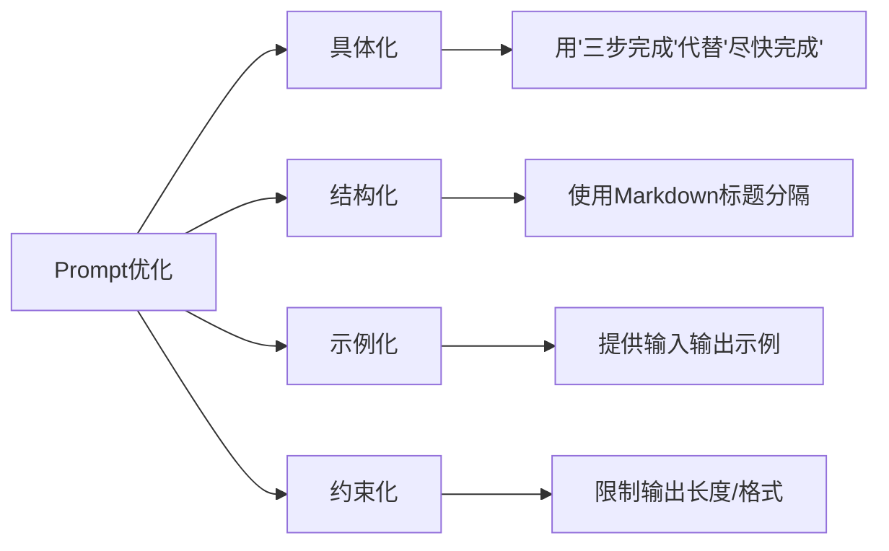
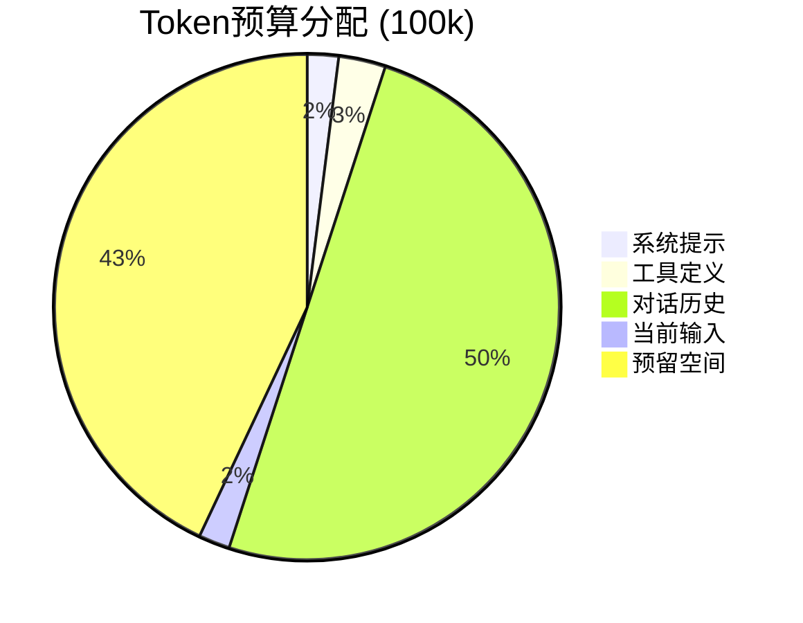
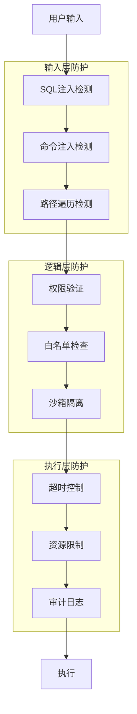
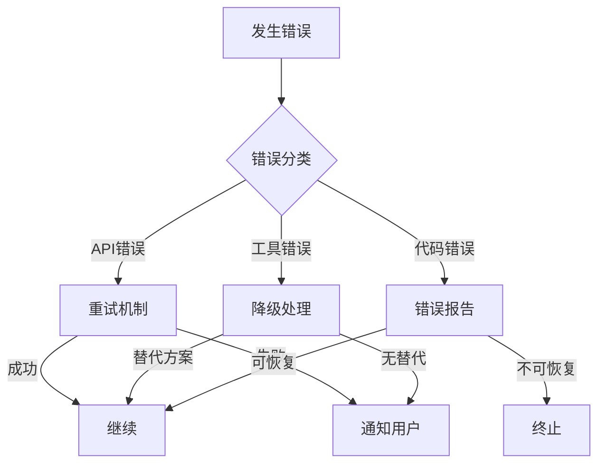
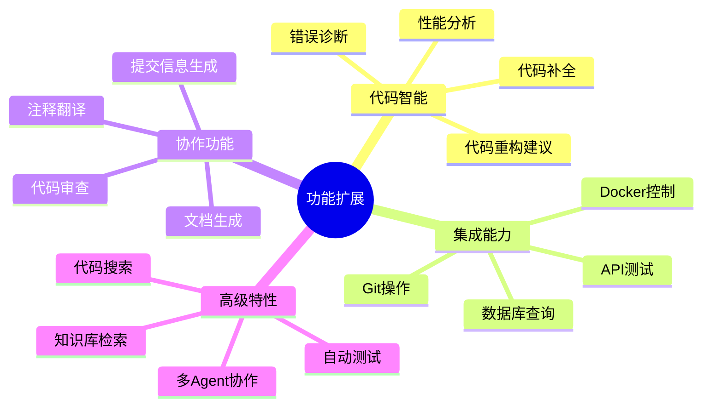

# 05-关键技术

深入理解实现AI编程助手的核心技术要点。

## 🎯 Prompt Engineering

### 系统提示词设计

> [!tip] 好的系统提示词 = 清晰的角色定义 + 明确的行为规范 + 约束条件

```python
SYSTEM_PROMPT = """你是一个专业的AI编程助手，名为"CodeHelper"。

## 核心职责
1. 帮助用户理解和修改代码
2. 执行文件操作和命令
3. 回答编程相关问题

## 行为准则
- 始终用中文回复
- 代码块使用合适的语法高亮
- 操作前确认可能影响大的操作
- 遇到错误时给出解决方案

## 可用工具
- read_file: 读取文件内容
- write_file: 写入文件
- run_command: 执行命令
- list_directory: 列出目录

## 安全限制
- 只能访问当前工作目录内的文件
- 禁止执行危险命令（rm -rf等）
"""
```

### Prompt优化技巧



## 🔧 工具调用最佳实践

### 工具设计原则

| 原则 | 说明 | 示例 |
|------|------|------|
| **单一职责** | 一个工具只做一件事 | `read_file` 只读取，不修改 |
| **自描述** | 工具名和描述清晰 | `search_code` vs `grep` |
| **参数验证** | 输入参数要校验 | 路径不能包含 `..` |
| **错误处理** | 返回结构化错误 | `{"success": false, "error": "..."}` |

### 工具调用流程优化

```mermaid
sequenceDiagram
    participant LLM
    participant Agent
    participant Tool
    
    Note over LLM,Tool: 优化前：串行调用
    LLM->>Agent: 需要调用 tool_a
    Agent->>Tool: 执行 tool_a
    Tool-->>Agent: 结果
    Agent->>LLM: 返回结果
    LLM->>Agent: 需要调用 tool_b
    ...
    
    Note over LLM,Tool: 优化后：并行调用
    LLM->>Agent: 需要调用 tool_a, tool_b
    par 并行执行
        Agent->>Tool: 执行 tool_a
        Agent->>Tool: 执行 tool_b
    end
    Tool-->>Agent: 结果 a
    Tool-->>Agent: 结果 b
    Agent->>LLM: 返回所有结果
```

## 🧠 上下文管理策略

### Token预算分配



### 智能截断策略

```python
def smart_truncate(messages, max_tokens=80000):
    """智能截断消息历史"""
    
    # 保留系统消息
    system_msgs = [m for m in messages if m['role'] == 'system']
    
    # 保留最近的高质量对话
    recent_msgs = messages[-10:]  # 保留最近5轮
    
    # 中间部分做摘要
    middle_msgs = messages[len(system_msgs):-10]
    if middle_msgs:
        summary = generate_summary(middle_msgs)
        middle_msgs = [{'role': 'system', 'content': f'历史摘要: {summary}'}]
    
    return system_msgs + middle_msgs + recent_msgs
```

## 🔒 安全防护机制

### 多层防护架构



### 安全检查代码示例

```python
import re

class SecurityChecker:
    """安全检查器"""
    
    DANGEROUS_PATTERNS = [
        r'rm\s+-rf\s+/',
        r':\(\)\s*\{\s*:\|:\|\s*\&\s*\};\s*:',
        r'\$\{IFS\}',
        r'\\x[0-9a-fA-F]{2}',
        r'`.*?`',
        r'\$\(.*\)',
    ]
    
    @classmethod
    def check_command(cls, command: str) -> bool:
        """检查命令是否安全"""
        for pattern in cls.DANGEROUS_PATTERNS:
            if re.search(pattern, command):
                return False
        return True
    
    @classmethod
    def sanitize_path(cls, path: str, base_path: str) -> str:
        """净化路径，防止目录遍历"""
        import os
        abs_path = os.path.abspath(os.path.join(base_path, path))
        base_abs = os.path.abspath(base_path)
        
        if not abs_path.startswith(base_abs):
            raise ValueError(f"路径越界: {path}")
        
        return abs_path
```

## ⚡ 性能优化

### 响应速度优化

| 优化点 | 方法 | 效果 |
|--------|------|------|
| 流式输出 | 使用streaming API | 首字延迟降低80% |
| 工具缓存 | 缓存文件读取结果 | 减少重复IO |
| 并行执行 | 多个工具同时执行 | 总耗时降低 |
| 预连接 | 保持API连接池 | 减少连接开销 |

### 流式输出实现

```python
from rich.live import Live
from rich.spinner import Spinner

def stream_response(self, user_input):
    """流式输出响应"""
    self.messages.append({"role": "user", "content": user_input})
    
    with Live(Spinner('dots', text='思考中...'), refresh_per_second=4) as live:
        full_response = ""
        
        with self.client.messages.stream(
            model=self.model,
            max_tokens=4096,
            messages=self.messages
        ) as stream:
            for text in stream.text_stream:
                full_response += text
                live.update(Markdown(full_response))
    
    self.messages.append({"role": "assistant", "content": full_response})
    return full_response
```

## 🔄 错误恢复机制

### 错误处理策略



### 重试机制实现

```python
from functools import wraps
import time

def retry_on_error(max_retries=3, delay=1):
    """重试装饰器"""
    def decorator(func):
        @wraps(func)
        def wrapper(*args, **kwargs):
            for attempt in range(max_retries):
                try:
                    return func(*args, **kwargs)
                except Exception as e:
                    if attempt == max_retries - 1:
                        raise
                    print(f"⚠️ 第{attempt + 1}次尝试失败，{delay}秒后重试...")
                    time.sleep(delay)
            return None
        return wrapper
    return decorator

class CodeAgent:
    @retry_on_error(max_retries=3)
    def call_llm(self, messages):
        """带重试的LLM调用"""
        return self.client.messages.create(...)
```

## 📊 监控与调试

### 日志设计

```python
import logging
from datetime import datetime

class AgentLogger:
    """Agent专用日志器"""
    
    def __init__(self):
        self.logger = logging.getLogger('code_agent')
        self.logger.setLevel(logging.DEBUG)
        
        # 文件日志
        fh = logging.FileHandler(f'agent_{datetime.now():%Y%m%d}.log')
        fh.setLevel(logging.DEBUG)
        
        # 控制台日志
        ch = logging.StreamHandler()
        ch.setLevel(logging.INFO)
        
        self.logger.addHandler(fh)
        self.logger.addHandler(ch)
    
    def log_tool_call(self, tool_name, params, result):
        """记录工具调用"""
        self.logger.debug(f"工具调用: {tool_name}")
        self.logger.debug(f"参数: {params}")
        self.logger.debug(f"结果: {result}")
    
    def log_llm_interaction(self, prompt, response):
        """记录LLM交互"""
        self.logger.debug(f"Prompt: {prompt[:200]}...")
        self.logger.debug(f"Response: {response[:200]}...")
```

### 调试技巧

| 问题 | 诊断方法 | 解决方案 |
|------|----------|----------|
| 工具不调用 | 检查工具定义 | 确保schema正确 |
| 上下文丢失 | 查看消息历史 | 检查消息格式 |
| 响应慢 | 分析各阶段耗时 | 优化慢速环节 |
| Token超限 | 统计token使用 | 截断历史消息 |

## 🚀 扩展方向

### 可扩展功能列表



> [!success] 技术掌握检查清单
> - [ ] 理解Prompt Engineering
> - [ ] 掌握工具设计最佳实践
> - [ ] 能设计上下文管理策略
> - [ ] 实现安全防护机制
> - [ ] 优化性能和响应速度
> - [ ] 建立错误恢复能力
> - [ ] 添加监控和调试能力

下一步：[[06-扩展阅读]] 获取更多学习资源
