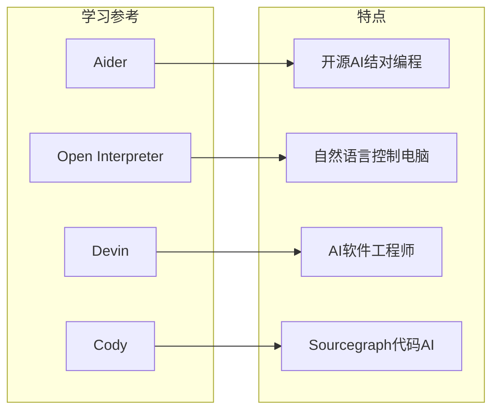
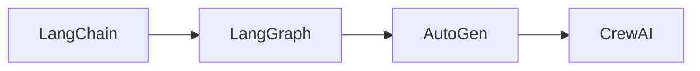
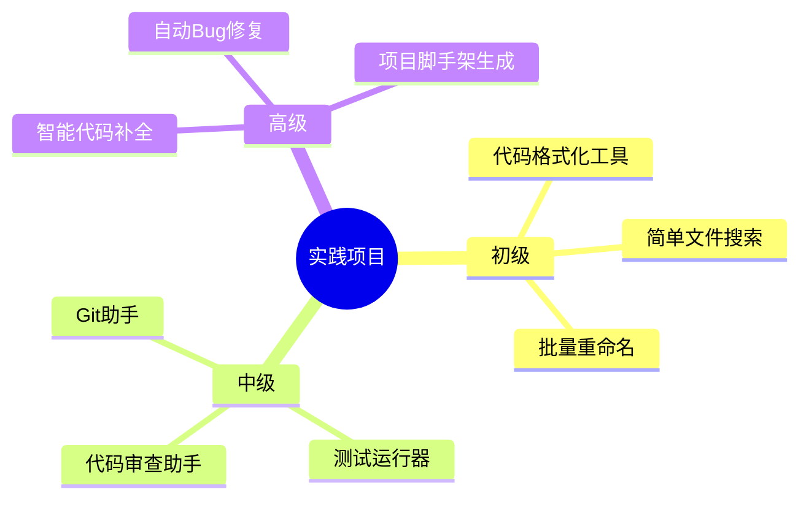
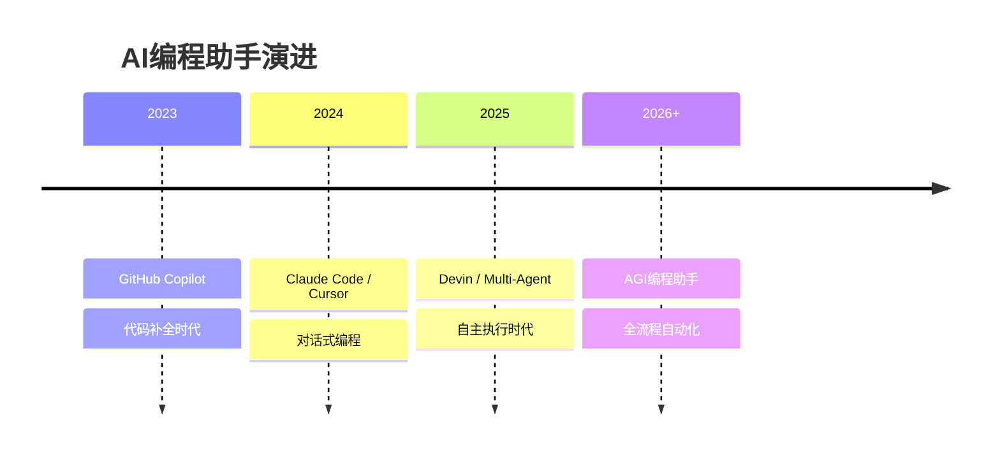

# 06-扩展阅读

## 📚 推荐资源

### 官方文档

| 资源 | 链接 | 说明 |
|------|------|------|
| **Anthropic Claude API** | https://docs.anthropic.com | Claude官方API文档 |
| **OpenAI Function Calling** | https://platform.openai.com | OpenAI工具调用指南 |
| **LangChain** | https://python.langchain.com | AI应用开发框架 |

### 开源项目



| 项目 | GitHub | 特点 |
|------|--------|------|
| **Aider** | paul-gauthier/aider | 支持多文件编辑，Git集成 |
| **Open Interpreter** | OpenInterpreter/open-interpreter | 让LLM控制你的电脑 |
| **Continue** | continuedev/continue | VSCode/Cursor插件 |
| **Claude Dev** | saoudrizwan/claude-dev | Claude驱动的Dev模式 |

### 技术文章

#### 中文资源

- [Claude Code 使用指南](https://docs.anthropic.com/claude-code/welcome) - 官方中文版
- [Function Calling详解](https://platform.openai.com/docs/guides/function-calling) - OpenAI工具调用
- [构建你的第一个AI Agent](https://www.langchain.com.cn/) - LangChain中文教程

#### 英文资源

- [Building effective agents](https://www.anthropic.com/research/building-effective-agents) - Anthropic官方
- [ReAct Pattern](https://react-lm.github.io/) - ReAct论文
- [Agent Design Patterns](https://blog.langchain.dev/agent-design-patterns/) - LangChain设计模式

## 🎓 进阶学习路径

### 阶段一：巩固基础


- [ ] 完整实现本教程的所有功能
- [ ] 阅读Aider的源码学习最佳实践
- [ ] 为自己的Agent添加至少一个新工具

### 阶段二：框架学习



| 框架 | 特点 | 适合场景 |
|------|------|----------|
| **LangChain** | 生态丰富 | 快速原型开发 |
| **LangGraph** | 状态管理 | 复杂工作流 |
| **AutoGen** | 多Agent | 多角色协作 |
| **CrewAI** | 易用 | 团队协作任务 |

### 阶段三：深入研究

- **LLM原理**: Transformer架构、注意力机制
- **Prompt工程**: Chain-of-Thought、Few-shot学习
- **RAG技术**: 检索增强生成
- **微调技术**: LoRA、QLoRA等参数高效微调

## 🔧 实用工具

### 开发工具

| 工具 | 用途 | 推荐 |
|------|------|------|
| **uv** | Python包管理 | ⭐⭐⭐⭐⭐ |
| **ruff** | Python代码检查 | ⭐⭐⭐⭐⭐ |
| **mypy** | 类型检查 | ⭐⭐⭐⭐ |
| **pytest** | 测试框架 | ⭐⭐⭐⭐⭐ |
| **rich** | 终端美化 | ⭐⭐⭐⭐⭐ |

### API工具

```bash
# 测试API
curl https://api.anthropic.com/v1/messages \
  -H "x-api-key: $ANTHROPIC_API_KEY" \
  -H "anthropic-version: 2023-06-01" \
  -H "content-type: application/json" \
  -d '{
    "model": "claude-3-5-sonnet-20241022",
    "max_tokens": 1024,
    "messages": [{"role": "user", "content": "Hello!"}]
  }'
```

## 💡 项目实践建议

### 练习项目



### 给读者的挑战

> [!tip] 挑战任务
> 完成以下任务，检验你的学习成果：

1. **基础挑战**: 实现一个能读取README并总结内容的Agent
2. **进阶挑战**: 添加Git操作工具（status, diff, commit）
3. **高级挑战**: 实现代码重构功能（重命名变量、提取函数）

## 🤝 社区资源

### 讨论社区

- **Reddit r/LocalLLaMA** - 本地LLM讨论
- **Discord Anthropic** - 官方社区
- **GitHub Discussions** - 开源项目讨论

### 中文社区

- **知乎专栏** - AI应用开发
- **掘金** - 技术文章分享
- **B站** - 视频教程

## 📊 技术发展趋势

### AI编程助手发展方向



## 📝 术语表

| 术语 | 英文 | 说明 |
|------|------|------|
| LLM | Large Language Model | 大语言模型 |
| Agent | AI Agent | 人工智能代理 |
| RAG | Retrieval-Augmented Generation | 检索增强生成 |
| ReAct | Reasoning + Acting | 推理+行动模式 |
| Tool Calling | Function Calling | 工具/函数调用 |
| Prompt | Prompt | 提示词 |
| Token | Token | LLM处理的最小单位 |
| Context | Context | 上下文 |
| Streaming | Streaming | 流式输出 |
| Embedding | Embedding | 文本向量表示 |

## 🎯 下一步行动

> [!success] 行动清单
> 看完本教程后，建议你：

1. **立即动手** - 开始实现你自己的Agent
2. **加入社区** - 关注相关开源项目
3. **持续学习** - AI领域发展迅速，保持学习
4. **分享经验** - 写博客或录视频，教别人
5. **探索创新** - 思考Agent在特定领域的应用

---

*恭喜你完成了 Learn Claude Code 的学习！*

*现在，开始构建你自己的AI编程助手吧！🚀*
