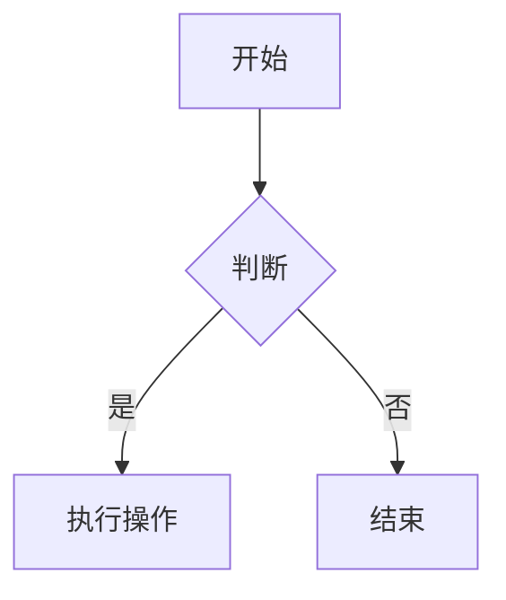

# 第二篇笔记

这篇笔记展示更多 Obsidian 特性。

## 数学公式

行内公式：$E = mc^2$

块级公式：
$$
\frac{a}{b} = c
$$

## Mermaid 图表

## 表格

| 特性 | 支持 | 说明 |
|------|------|------|
| Wikilinks | ✅ | 自动解析 |
| Callouts | ✅ | 完美渲染 |
| 图表 | ✅ | Mermaid |
| 搜索 | ✅ | 全文检索 |

## 关联笔记

- [[index|首页]]
- [[第一篇笔记]]

> [!tip]
> 点击左侧的 Graph View 可以查看笔记之间的关系图谱！
